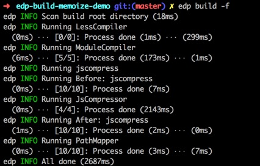
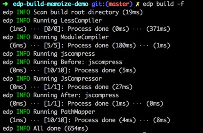

# edp-build memoize demo

> edp build memoize

## PreInstall

```
$ npm install -g edp
```

## Usage

```
$ git clone https://github.com/junmer/edp-build-memoize-demo
$ cd edp-build-memoize-demo
$ npm install edp-build-memoize --save-dev
$ edp build -f
```

## Config

```js
var MemoizeProcessor = require('edp-build-memoize');

exports.getProcessors = function () {

    var jsProcessor = new JsCompressor();
    jsProcessor = new MemoizeProcessor(jsProcessor, {
        name: 'jscompress',
        files: ['*.js']
    });

    return [jsProcessor];

});
```

## Showcase

- first build



- memoize build



## Related

- [edp-build-memoize](https://github.com/junmer/edp-build-memoize)
- [edp](https://github.com/ecomfe/edp)
